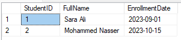

# Task: Exploring SQL Server Backup Types 
 
## Part 1: Research Task 

### Objective: 
Understand the different types of backup available in SQL Server. 
### Instructions:
**1. Search for and summarize the following backup types:** 

**a. Full Backup** -> A full backup captures the entire database at a specific point in time, including all data and objects. It is the foundation for other types of backups.

**b. Differential Backup** -> A differential backup captures only the data that has changed since the last full backup. It is faster than a full backup and requires less storage space.

**c. Transaction Log Backup** -> A transaction log backup captures all the transactions that have occurred since the last transaction log backup. It allows for point-in-time recovery and is essential for databases in full recovery mode.

**d. Copy-Only Backup** -> A copy-only backup is a special type of backup that does not affect the sequence of regular backups. It is used for ad-hoc backups without disrupting the backup chain.

**e. File/Filegroup Backup** -> A file or filegroup backup allows you to back up specific files or filegroups within a database. This is useful for large databases where you may want to back up only certain parts without affecting the entire database.

**2. For each backup type, include:** 

**a. When it is used**

**b. What it includes**

**c. Pros & cons**

**d. Real-world scenario (e.g., banking system, e-learning platform, ticketing system)**

### Deliverable: 

Write your findings in a simple report (1–2 pages). Use diagrams if needed.

# Exploring SQL Server Backup Types

| Backup Type            | When Used                                          | What It Includes                                        | Pros                                                              | Cons                                                    | Real-World Scenario                                                      |
|------------------------|----------------------------------------------------|---------------------------------------------------------|-------------------------------------------------------------------|---------------------------------------------------------|--------------------------------------------------------------------------|
| Full Backup            | Initial backup or periodic backups                 | Entire database, all data and objects                   | Comprehensive, allows for complete recovery                       | Time-consuming, large storage requirement               | Banking system: Initial full backup of customer data                     |
| Differential Backup    | After a full backup, for changes                   | Data changed since the last full backup                 | Faster than full backup, less storage needed                      | Cannot restore without a full backup                    | E-learning platform: Daily backups of course content                     |
| Transaction Log Backup | Continuous, after each transaction log backup      | All transactions since the last log backup              | Point-in-time recovery, essential for full recovery mode          | Requires regular backups, can grow large                | Ticketing system: Frequent updates to ticket status                      |
| Copy-Only Backup       | Ad-hoc backups, without disrupting regular backups | Does not affect backup sequence, captures current state | Useful for one-time backups, does not interfere with backup chain | Not suitable for regular backups, can lead to confusion | E-learning platform: Backup of course content before major updates       |
| File/Filegroup Backup  | For large databases, specific parts                | Specific files or filegroups within a database          | Saves time and storage, allows selective backups                  | Complexity in management, requires careful planning     | Banking system: Backing up only transaction logs and customer data files |

---------------------------

## Part 2: Practice Tasks (using a test database like TrainingDB) 


**Step 1: Create Test Database** 
```sql

CREATE DATABASE TrainingDB; 
GO 
USE TrainingDB; 
GO 
CREATE TABLE Students ( 
    StudentID INT PRIMARY KEY, 
    FullName NVARCHAR(100), 
    EnrollmentDate DATE 
); 
```
**Step 2: Insert Sample Data**
```sql
INSERT INTO Students VALUES  
(1, 'Sara Ali', '2023-09-01'), 
(2, 'Mohammed Nasser', '2023-10-15'); 

```
**Students Table**



--------
## Step 3: Perform Backup Operations
**1. Full Backup**
```sql
BACKUP DATABASE TrainingDB TO DISK = 'C:\Backups\TrainingDB_Full.bak';
```


**2. Insert New Record (simulate data change)**
```sql
INSERT INTO Students VALUES (3, 'Fatma Said', '2024-01-10');
```


**3. Differential Backup**
```sql
BACKUP DATABASE TrainingDB TO DISK = 'C:\Backups\TrainingDB_Diff.bak' WITH DIFFERENTIAL;
```


**4. Transaction Log Backup**
```sql
-- First make sure Recovery Model is FULL
ALTER DATABASE TrainingDB SET RECOVERY FULL;
-- Now backup the log
BACKUP LOG TrainingDB TO DISK = 'C:\Backups\TrainingDB_Log.trn';
```


**5. Copy-Only Backup**
```sql
BACKUP DATABASE TrainingDB TO DISK = 'C:\Backups\TrainingDB_CopyOnly.bak' WITH
COPY_ONLY;

```


---------------------

## Part 4: Real-World Scenario Simulation
**Scenario:**
You are a database admin for a hospital system.
On Sunday you take a full backup. Each night, you take a differential backup. Every hour, you
back up the transaction log.

**Challenge Task:**
Design a backup schedule for this hospital system using SQL scripts. Assume the database is
called HospitalDB. 

**Include:**

• Backup frequency

• Type of backup for each day/time

• Folder naming and file versioning convention

**Deliverable:** 
A .sql file or script plan + brief description of the strategy

### Backup for HospitalDB

```sql
-- Create HospitalDB

CREATE DATABASE HospitalDB;
   

USE HospitalDB;


-- Create Departments table
CREATE TABLE Departments (
    DepartmentID INT PRIMARY KEY IDENTITY(1,1),
    DepartmentName NVARCHAR(100) NOT NULL
);

-- Create Doctors table
CREATE TABLE Doctors (
    DoctorID INT PRIMARY KEY IDENTITY(1,1),
    FirstName NVARCHAR(50),
    LastName NVARCHAR(50),
    DepartmentID INT,
    FOREIGN KEY (DepartmentID) REFERENCES Departments(DepartmentID)
);


-- Create Patients table
CREATE TABLE Patients (
    PatientID INT PRIMARY KEY IDENTITY(1,1),
    FirstName NVARCHAR(50),
    LastName NVARCHAR(50),
    DateOfBirth DATE,
    Gender NVARCHAR(10)
);


-- Create Appointments table
CREATE TABLE Appointments (
    AppointmentID INT PRIMARY KEY IDENTITY(1,1),
    PatientID INT,
    DoctorID INT,
    AppointmentDate DATETIME,
    Reason NVARCHAR(255),
    FOREIGN KEY (PatientID) REFERENCES Patients(PatientID),
    FOREIGN KEY (DoctorID) REFERENCES Doctors(DoctorID)
);


-- Insert sample data into Departments
INSERT INTO Departments (DepartmentName)
VALUES 
('Cardiology'),
('Neurology'),
('Pediatrics'),
('Orthopedics');


-- Insert sample data into Doctors
INSERT INTO Doctors (FirstName, LastName, DepartmentID)
VALUES
('Alice', 'Smith', 1),
('Bob', 'Johnson', 2),
('Carol', 'Williams', 3),
('David', 'Brown', 4);


-- Insert sample data into Patients
INSERT INTO Patients (FirstName, LastName, DateOfBirth, Gender)
VALUES
('John', 'Doe', '1985-03-15', 'Male'),
('Jane', 'Doe', '1990-07-22', 'Female'),
('Emily', 'Clark', '2001-11-30', 'Female'),
('Michael', 'Lee', '1975-01-05', 'Male');


-- Insert sample data into Appointments
INSERT INTO Appointments (PatientID, DoctorID, AppointmentDate, Reason)
VALUES
(1, 1, '2025-06-01 09:00', 'Heart Checkup'),
(2, 2, '2025-06-01 10:30', 'Migraine'),
(3, 3, '2025-06-01 11:00', 'Vaccination'),
(4, 4, '2025-06-01 12:15', 'Back Pain');


```


**FULL BACKUP - Run Every Sunday at 12:00 AM**
```sql
BACKUP DATABASE HospitalDB
TO DISK = 'C:\Program Files\Microsoft SQL Server\MSSQL16.MSSQLSERVER\MSSQL\Backup\HospitalDB_Backups\Full\HospitalDB_Full_$(ESCAPE_NONE(WEEKDAY))_$(ESCAPE_NONE(DATE))_0000.bak'
WITH FORMAT, INIT, NAME = 'Full Backup of HospitalDB';
```


**DIFFERENTIAL BACKUP - Run Monday to Saturday at 12:00 AM**
```sql
BACKUP DATABASE HospitalDB
TO DISK = 'C:\Program Files\Microsoft SQL Server\MSSQL16.MSSQLSERVER\MSSQL\Backup\HospitalDB_Backups\Differential\HospitalDB_Diff_$(ESCAPE_NONE(WEEKDAY))_$(ESCAPE_NONE(DATE))_0000.bak'
WITH DIFFERENTIAL, INIT, NAME = 'Differential Backup of HospitalDB';
```


**TRANSACTION LOG BACKUP - Run Every Hour**

```sql
BACKUP LOG HospitalDB
TO DISK = 'C:\Program Files\Microsoft SQL Server\MSSQL16.MSSQLSERVER\MSSQL\Backup\HospitalDB_Backups\Logs\HospitalDB_Log_$(ESCAPE_NONE(DATE))_$(ESCAPE_NONE(TIME)).trn'
WITH INIT, NAME = 'Transaction Log Backup of HospitalDB';
```


---------

## Follow-Up Task: Restore the Database from Your Backup Files

**Scenario:**

Emergency Recovery Simulation for TrainingDB

Today, you practiced backing up your database TrainingDB using different types of backups: 
- Full Backup 
- Differential Backup 
- Transaction Log Backup 
- Copy-Only Backup 

**Now simulate this real-world problem:**

This afternoon, the TrainingDB system crashed. Your manager asks you to **recover the 
database up to the last transaction log backup** you made. Your goal is to bring the database 
back to the most recent state — using your backup files only.

**Instructions:**

**Step 1: Drop the Current Database (Simulate System Failure)**
```sql
DROP DATABASE TrainingDB;

```

**Step 2: Restore from Your Backups**
Use the **same file names and paths** you used earlier. Replace them accordingly. 

**1. Restore FULL backup**
```sql
RESTORE DATABASE TrainingDB  
FROM DISK = 'C:\Program Files\Microsoft SQL Server\MSSQL16.MSSQLSERVER\MSSQL\Backup\TrainingDB_Full.bak' 
WITH NORECOVERY; 
 ```


**2. Restore DIFFERENTIAL backup (if you created one)**
```sql 
RESTORE DATABASE TrainingDB  
FROM DISK = 'C:\Program Files\Microsoft SQL Server\MSSQL16.MSSQLSERVER\MSSQL\Backup\TrainingDB_Diff.bak' 
WITH NORECOVERY; 
 ```

**3. Restore TRANSACTION LOG backup (if you created one)**
```sql
RESTORE LOG TrainingDB  
FROM DISK = 'C:\Program Files\Microsoft SQL Server\MSSQL16.MSSQLSERVER\MSSQL\Backup\TrainingDB_Log.trn' 
WITH RECOVERY; 
    
```

- Use WITH NORECOVERY until the final step. 
- Use WITH RECOVERY only at the last step.

---
**Step 3: Verify the Restored Data**
```sql

USE TrainingDB; 
SELECT * FROM Students; 
```

Check if all the records (including the last one you added before the transaction log backup) are 
there.


---
**Reflection Questions:** 
1. What would happen if you skipped the differential backup step? 
- If you skip the differential backup step, you would only restore the database to the state of the last full backup. Any changes made after that full backup and before the differential backup would be lost, resulting in potential data loss.
2. What’s the difference between restoring a full vs. copy-only backup? 
- A full backup restores the entire database and is part of the regular backup chain, affecting the sequence of subsequent backups. A copy-only backup, however, does not affect the backup chain and is used for ad-hoc backups without disrupting the regular backup process. It allows you to take a snapshot of the database without altering the existing backup sequence.
3. What happens if you use WITH RECOVERY in the middle of a restore chain? 
- Using WITH RECOVERY in the middle of a restore chain will finalize the restore process, making the database available for use. However, it will prevent any further restores (like differential or transaction log backups) from being applied. This means you cannot continue restoring additional backups after using WITH RECOVERY, which could lead to incomplete recovery if there are more backups to apply.
4. Which backup types are optional and which are mandatory for full recovery?
- Full backups and transaction log backups are mandatory for full recovery. Differential backups are optional but recommended for faster recovery. Copy-only backups are also optional and used for specific scenarios without affecting the backup chain. File/filegroup backups are optional and used for selective backup of large databases.


